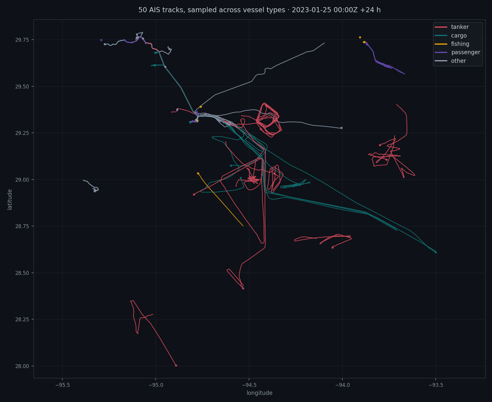

# Stage 3 — Phase 1 report

**Jaiveer · 8 September 2026 · for Akshat**

Short version: the AIS machinery works on real data. I can take a raw NOAA file, pull out
the ships in any patch of ocean, rebuild their journeys, and hand you valid output files.
Scoring starts next.

While checking the data I found three things worth knowing before Phase 2. **One of them
needs a decision from you** — it's small, and it's at the end.

---

## 1. What my stage does, in plain words

Anushka's stage tells us roughly *where* the oil started and roughly *when*.

My job is to answer: **which ships were in that area at that time, and which one most likely
did it?**

Big ships broadcast their position over radio every few minutes — position, speed, heading,
and what kind of ship they are. It's called AIS. The US government publishes years of these
broadcasts free, one big file per day.

So I take the origin cloud, find every ship that was inside it during the time window, score
them, and produce a ranked shortlist plus at least one ship we ruled out.

No AI anywhere in my part. It's filtering and a weighted sum, which means I can explain
exactly why any ship ranked where it did.

---

## 2. What I built

Three scripts in `pipeline/attribute/`.

**`ingest.py` — shrinks the haystack.**
A NOAA daily file is 800 MB of text covering all US waters — Alaska, Hawaii, both coasts,
the Great Lakes. Millions of lines. Loading that into pandas freezes the laptop, so instead
DuckDB reads the file in a stream and throws away every line outside my map box *as it
reads*. Nothing piles up in memory. The surviving rows get saved in a compact format called
Parquet, so every later query is instant. You pay that cost once.

It can also read the box and the time window straight out of an `origin.json`, padded to
twice `radius_90_km`. That means when the real origin arrives I swap one file and rerun —
no code changes.

**`tracks.py` — turns dots into journeys.**
The filtered rows are just scattered points: "ship X was here at this moment." This groups
them by ship ID, sorts by time, and gives each vessel a path. It also measures the silences
between reports, which is one of the five scoring signals.

It deliberately refuses to guess. If a ship went quiet for three hours, it will not draw a
straight line through the gap — that would invent a position that never happened, and an
invented position could end up scoring as a suspect. Anything over 30 minutes is left as a
hole. **A long silence is evidence, not something to patch over.**

**`plot_tracks.py` — lets me check the work with my eyes.**
No test can tell you "these look like real ships." Only looking can.

---

## 3. The numbers

One day, 25 January 2023, one box off Galveston, Texas.

| | |
|---|---|
| Raw file | 800 MB, millions of broadcasts |
| Kept after the box filter | **677,102** broadcasts — 11 MB |
| Distinct ships in those | **987** |
| Ships with a usable journey | **972** (15 dropped, see problem 3) |

I also ran your stub through the validator to prove my *output* shape, not just my input:

```
funnel 412 -> 63 -> 12 -> 3, 2 exclusion(s)
PASS  acts=['detect', 'trace', 'attribute']  (0 warning(s))
```

Both seams are proven. Real AIS goes in one end, schema-valid files come out the other.

---

## 4. The picture



50 journeys, sampled evenly across the five vessel types.

**Why this counts as proof.** Look where the lines meet — they all funnel into one point
around −94.7, 29.35. That's the entrance to Galveston Bay at Bolivar Roads, and real traffic
funnels through harbour entrances. One lane runs northwest up the Houston Ship Channel,
another heads out southeast into open water.

Nothing teleports, nothing zigzags across the map. If longitude and latitude were swapped
anywhere, this would be a scrambled mess instead. It isn't.

The tangled red loops out to the right are tankers swinging at anchor in the anchorages —
that's real behaviour, not a bug.

---

## 5. Three things I found

### Problem 1 — Our vessel categories don't describe the Gulf *(needs your call)*

This one needs a decision, so here it is properly.

`type_prior` is one of the five scoring signals, worth 10%. It's a lookup table that gives a
ship a small head start based on what kind of ship it is: tanker 1.0, cargo 1.0, fishing 0.4,
passenger 0.2, other 0.5.

That table has five categories. When I sorted my 972 ships into them:

| Category | Ships |
|---|---|
| other | **685** (70%) |
| tanker | 156 |
| cargo | 64 |
| passenger | 45 |
| fishing | 22 |

Seven out of ten ships landed in `other`. That's not a category, it's a leftover pile — and
`other` isn't a label in the data, it's what our own rule produces for anything it doesn't
recognise.

So I opened the pile. Every AIS broadcast carries a number saying what type of vessel it is,
defined by an international standard. Inside `other`:

| Code | Meaning | Ships |
|---|---|---|
| 31 | Towing | **362** |
| 37 | Pleasure craft | 100 |
| 90 | Other type | 56 |
| 57 | Local vessel | 40 |
| 52 | Tug | **39** |
| 36 | Sailing | 39 |
| 32 | Towing (large) | **3** |
| — | rest | 46 |

**404 ships — 42% of the entire fleet — are tugs and vessels pushing or towing barges.** More
than double the tanker count. In the Gulf, that's how a lot of refined petroleum actually
moves.

There are two asks here, and they're deliberately separate — one is safe today, the other
needs a number I don't have yet.

#### Ask A — the label *(now, no scoring change)*

Right now a suspect card would say "other" for a vessel that is visibly a tug. Can I add
`tug` and `tow` as **display labels only**, with `type_prior` completely untouched? They
keep 0.5, nothing reranks, no score moves anywhere. Purely what the card says.

#### Ask B — the prior *(only if the data earns it)*

The real question is whether these vessels should score higher, and there's a genuine
argument that they should: **tank barges carry most of America's domestic refined
petroleum.** Per a Congressional Research Service report, barges were 82% of the tank
vessel fleet's cargo capacity in 2012 and carried about 65% of coastwise refined product
tonnage, up from 39% of capacity in 1980. The Jones Act tanker fleet is down to eleven
petroleum tankers. If a class carries the oil, it is a plausible source of spilled oil.

**But I can't get from that to my 404 yet.** AIS code 31 means "this vessel is towing
something" — it does not say what. A tanker's code *is* its cargo; the digit even encodes
hazard class. A tug declares only that it's pushing a barge, and the code is identical
whether that barge holds gasoline, gravel, grain, or nothing at all because it's doing
ship-assist work in the harbour. Galveston has all of those. So 404 is *towing vessels*, not
404 oil carriers, and I don't yet know the split.

**Two things I explicitly am NOT arguing.** Not "there are lots of them" — abundance is
already counted, since more tugs in the water means more tugs in the plausible set, and
raising the prior on top of that counts the same fact twice. And not a made-up number: if I
proposed 0.7, the honest answer to "why 0.7?" would be "it felt right", which is worse than
the mismatch we have now.

**Ask A stands regardless; Ask B I'll only bring you if the data supports it.**

*(Caveat: one day, one box, and Galveston fronts the busiest petrochemical complex in the US.
42% is probably an upper bound. I'll rerun this on whichever case you pick.)*

### Problem 2 — Two scoring signals don't work on port traffic *(mine to fix)*

Half the fleet isn't going anywhere: **487 of 972 ships average under 0.5 knots all day**,
tied up at docks or sitting at anchor. Normal for a port. But two of my five signals assume
a ship that's moving.

**The radio-gap signal** is meant to catch a ship going dark while it dumps. Of the ships
with a 30+ minute silence, 73 were parked and only 51 were actually moving — so **59% of
what it catches is a docked boat whose transponder idled overnight.**

**The slowdown signal** is worse. It compares a ship's speed against its own median. But 638
of 972 ships have a median speed of exactly zero, and you can't go slower than stopped — so
for two-thirds of the fleet the test can never fire at all. And where it does fire, 77 ships
match the pattern "was moving at 4–5 knots, then touched zero" — that's arriving and mooring,
the most ordinary thing a ship does in a harbour, and every one collects the full point.

**Fix:** only count a silence if the ship was moving on both sides of it, and only count a
slowdown if it happens near the origin rather than anywhere in the window. That's defining
*when a signal applies*, not tuning weights — and I'll state the rule openly rather than
hiding it in an `if`.

Worth noting: your cut list already had slowdown as the first component to drop if we run
short. These numbers say that was the right instinct on merit, not just on schedule.

### Problem 3 — 15 ships vanish without a word *(not important — mine to fix, two lines)*

15 vessels were dropped for having fewer than 5 broadcasts in my box. Dropping them is
correct — you can't build a path from one dot, and four of the five signals would be blank.

But the silence isn't correct. Right now nobody is told they existed.

**Fix:** print the count under the funnel — *"15 vessels had too few reports in this region
to reconstruct a track."* It turns a hidden assumption into a stated limitation, same
instinct as the exclusion card. It also gives a real investigator a thread to pull: they can
request those ships' full history outside our box. We can't; a coast guard can.

---

## 6. What I need from you

1. **Yes or no on the tug/tow display labels** (Problem 1, Ask A). No scoring change either
   way. Ask B — whether petroleum-carrying tugs should take the tanker prior — comes to you
   separately, with evidence behind it, or not at all.
2. **Which US case are we running?** I need the incident days ±2 so I can download
   *consecutive* days. My current three files are three weeks apart — merged, every ship
   would appear to have a three-week radio gap.
3. **Heads up:** `cases/case-000/origin.json` sits over Ennore, India, in January 2017. My
   AIS is US, 2023. Scoring against it returns zero of everything, which looks like broken
   code but isn't. I'm building a US-located fake origin so Phase 2 can be tested properly.

---

## 7. Reproduce it

```bash
python pipeline/attribute/ingest.py --csv data/ais/AIS_2023_01_25.csv \
       --bbox -95.5 28.0 -93.5 29.8 --out data/ais/gulf.parquet
python pipeline/attribute/tracks.py --parquet data/ais/gulf.parquet
python pipeline/attribute/plot_tracks.py --parquet data/ais/gulf.parquet
python pipeline/attribute/run.py --case case-000 --stub
python scripts/validate_case.py cases/case-000
```

Raw AIS stays on my laptop — `data/` is gitignored. Only the finished output files travel.

**Next:** US fake origin, then Phase 2 scoring — the five components, the funnel counts, and
the exclusion.
